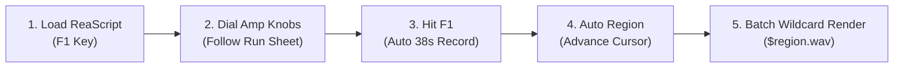

# 🎸 justin-parametric-nam

> **Parametric Neural Amp Modeler (NAM) Studio Re-Amping Automation & Cloud GPU Pipeline**  
> *Developed for Justin Muir • 48kHz / 24-bit Audio DSP Architecture*

[](file:///Users/danielbasssherizen/Developer/justin-parametric-nam/tests/test_audio_pipeline.py)
[](https://github.com/sdatkinson/neural-amp-modeler)
[](https://lightning.ai)
[](https://colab.research.google.com)
[](https://justin-muir-netops-hub.web.app/parametric-amp.html)

---

## ⚡ The Solution: Re-Amping Solved for Human Beings

Training a **Parametric Neural Amp Modeler** captures continuous amplifier behavior across multiple physical knob dimensions (Gain, Bass, Mid, Treble, Master). However, manual studio re-amping traditionally introduces three massive roadblocks:

1. **"Do I have to record two sweeps (training + validation) per knob position?"**  
   **No!** Our Latin Hypercube sampling matrix selects **43 training points** and **2 dedicated holdout points** (`take_41` and `take_42`). You only re-amp **one 38-second sweep per knob configuration** (45 takes total, ~28 minutes of studio time).

2. **"Can I run the audio sweeps locally without a GPU, then send the training offsite?"**  
   **Yes!** Studio re-amping requires zero GPU power. You capture the audio through your regular audio interface on your Mac or PC, zip the WAV files with `data.json`, and upload them to our free **Google Colab T4 GPU Notebook**. Colab handles the heavy math and downloads a ready-to-play `.nam` file.

3. **"Manually recording, naming, and exporting 45 files in a DAW will take forever. Can this be scripted?"**  
   **Yes!** We provide two automated re-amping workflows:
   - **Cockos REAPER ReaScript (`Reaper_AutoReamp_NAM.lua`)**: Single-hotkey automation that records exactly 38.0 seconds, creates color-coded regions, advances the cursor, and exports all 45 named WAVs via REAPER's wildcard region render in seconds.
   - **Headless Python CLI (`reamp_automation.py`)**: Zero-DAW CLI that plays the calibration sweep and records the amp return directly through PortAudio.

---

## 📁 Repository Architecture

```
justin-parametric-nam/
├── README.md                      # Complete studio guide & technical documentation
├── requirements.txt               # Audio & DSP dependencies (numpy, soundfile, sounddevice, torch)
├── .gitignore                     # Audio-safe gitignore (excludes raw *.wav takes and .nam files)
│
├── configs/
│   ├── model_concat.json          # Parametric WaveNet architecture (5 condition dimensions)
│   └── learning_concat.json       # Optimizer & loss hyperparameters (AdamW, ESR + MRSTFT Loss)
│
├── data/
│   ├── justin_nam_run_sheet.csv   # 45-take Latin Hypercube sampling matrix run sheet
│   └── data.json                  # PyTorch training manifest mapping takes to normalized coordinates
│
├── scripts/
│   ├── generate_run_sheet.py      # Zero-dependency matrix & data.json manifest generator
│   ├── reamp_automation.py        # Automated headless full-duplex PortAudio re-amping CLI
│   └── Reaper_AutoReamp_NAM.lua   # REAPER ReaScript 1-key automated recording & region tagging
│
├── notebooks/
│   └── colab_train_parametric_nam.ipynb # 1-Click Google Colab GPU batch trainer
│
├── firmware/
│   ├── rp2040_pico_pots.py        # Raspberry Pi Pico ADC potentiometer scanner with EMA filter
│   └── esp32_ble_midi.py          # ESP32-S3 wireless Bluetooth Low Energy (BLE) MIDI bridge
│
└── tests/
    └── test_audio_pipeline.py     # Determinism, boundary, schema, and EMA filter unit tests
```

---

## 🎛️ Workflow 1: Cockos REAPER Automation (Recommended)

Eliminates manual DAW arming, start/stop transport clicks, cutting, and export typing.



### 1-Minute REAPER Setup:
1. In REAPER: **Actions** -> **Show action list** -> **New action** -> **Load ReaScript** -> select `scripts/Reaper_AutoReamp_NAM.lua`.
2. Assign a keyboard shortcut (e.g. `F1` or `Numpad Enter`).
3. Setup two tracks:
   - **Track 1**: Name `SWEEP_PLAYBACK`. Insert `inputTrunc.wav` at `0:00.00`. Set its hardware output to your Re-Amp box.
   - **Track 2**: Name `AMP_RECORD`. Set its input to your interface channel receiving your load box or microphone. **Arm for recording**.

### Re-Amping:
1. Look at [data/justin_nam_run_sheet.csv](file:///Users/danielbasssherizen/Developer/justin-parametric-nam/data/justin_nam_run_sheet.csv) for Take 00.
2. Dial your physical amp knobs to match the run sheet.
3. Press `F1`. REAPER will:
   - Rewind/align the playhead
   - Record Track 2 for exactly 38.0 seconds while playing Track 1
   - Create a labeled region (e.g., `take_01_G6.5_B5.0_M8.5_T7.0_M3.5`)
   - Stop transport and advance the cursor 4.0 seconds past the take
4. Turn the knobs for the next take and press `F1` again.
5. When all 45 takes are finished:
   - Go to **File** -> **Render**.
   - Source: **All Project Regions**.
   - Bounds: **All regions**.
   - File name: `$region.wav`.
   - Click **Render 45 Files**. All 45 audio takes are rendered and named automatically!

---

## 💻 Workflow 2: Headless Python Re-Amping CLI

For a computer without a DAW installed, run re-amping straight from the terminal.

```bash
# 1. Install lightweight audio drivers
pip install sounddevice soundfile numpy

# 2. Check your audio interface channel indices
python3 scripts/reamp_automation.py --list-devices

# 3. Start interactive re-amping
python3 scripts/reamp_automation.py --in-ch 1 --out-ch 3 --outdir ./takes
```

**Features:**
- Real-time terminal prompts showing exact knob numbers (`GAIN: 6.5`, `BASS: 5.0`, etc.).
- Hit `[Enter]` to record; script monitors audio levels to alert you if a cable is unplugged.
- Automatically creates `takes/data.json` ready for PyTorch training.
- Safe to pause with `Ctrl+C` and resume anytime without losing progress.

---

## ☁️ Workflow 3: Google Colab 1-Click GPU Training

Train your custom parametric model on a high-speed cloud GPU without paying for local hardware.

1. Open [notebooks/colab_train_parametric_nam.ipynb](file:///Users/danielbasssherizen/Developer/justin-parametric-nam/notebooks/colab_train_parametric_nam.ipynb) in [Google Colab](https://colab.research.google.com).
2. Ensure hardware acceleration is enabled: **Runtime** -> **Change runtime type** -> **T4 GPU**.
3. Zip your rendered audio takes and `data.json`:
   ```bash
   zip -r takes.zip takes/ data.json
   ```
4. Run the Colab notebook cells:
   - **Cell 1**: Verifies NVIDIA GPU acceleration.
   - **Cell 2**: Installs PyTorch Lightning and the Parametric NAM engine.
   - **Cell 3**: Uploads `takes.zip`.
   - **Cell 4**: Trains the 5-dimensional continuous WaveNet (~35–45 minutes).
   - **Cell 5**: Automatically initiates browser download of your standalone `.nam` profile.

---

## 🔌 Hardware Control Box: Microcontroller Firmware

If you wish to build a physical hardware control box with analog potentiometers to control the parametric plugin or the companion app, firmware is provided under `firmware/`:

### 1. Raspberry Pi Pico (RP2040) USB Controller (`firmware/rp2040_pico_pots.py`)
- High-speed 1000Hz ADC polling with hardware interrupt support.
- **Exponential Moving Average (EMA) filter** ($\alpha = 0.18$) with deadband hysteresis to reject analog wiper micro-jitter.
- Emits standard USB-MIDI Control Change:
  - `CC #20`: Gain
  - `CC #21`: Bass
  - `CC #22`: Mid
  - `CC #23`: Treble
  - `CC #24`: Master

### 2. ESP32 / ESP32-S3 Wireless BLE MIDI (`firmware/esp32_ble_midi.py`)
- Broadcasts the official Apple/MMA Bluetooth Low Energy MIDI UUID (`03b80e5a-ede8-4b33-a028-d17a7430783c`).
- Connects wirelessly to macOS, iPadOS, and Windows without cables or third-party software.

---

## 🧪 Testing & Verification

Run the deterministic test suite to verify sampling matrix bounds, normalized schema compliance, and DSP smoothing filters:

```bash
python3 -m unittest tests/test_audio_pipeline.py
```

Expected output:
```
Ran 7 tests in 0.010s
OK
```

---

## 🌐 Companion Interactive Web Studio

Experience the real-time browser companion featuring photorealistic 3D tube glow, knurled analog knobs, graticule CRT oscilloscope, and audio AI co-pilot:

👉 **[Launch Justin's NetOps Parametric Amp Studio](https://justin-muir-netops-hub.web.app/parametric-amp.html)**

---

## 📜 License & Acknowledgments
- Built on the open-source [Neural Amp Modeler](https://github.com/sdatkinson/neural-amp-modeler) foundation by Steven Atkinson.
- Parametric multidimensional extensions inspired by Phillip M. Self.
- Tailored for Justin Muir's 48kHz audio engineering studio workflow.
